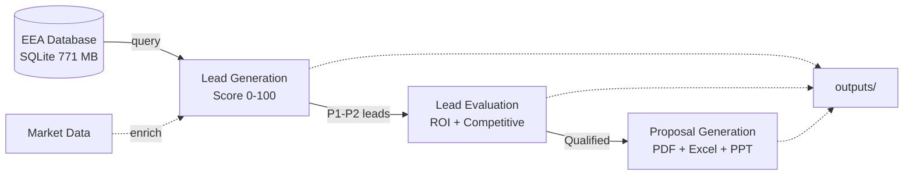

# EEA Industrial Emissions Data

B2B sales intelligence system that analyzes the European Environment Agency's industrial emissions database (~34,000 facilities) to generate leads for waste-to-energy and industrial emissions control equipment. Built for [GMAB/WET](https://www.SPIG-GMAB.com).

## What it does

A three-agent AI pipeline that:

1. **Scans** the EEA E-PRTR database and scores facilities on emission compliance, efficiency, waste heat potential, plant size, and upgrade urgency (0-100)
2. **Evaluates** top leads with ROI analysis, competitive positioning, and sales action plans
3. **Generates** proposal packages (PDF, Excel financial models, PowerPoint, compliance docs)

Target: WtE plants (MSW incinerators, RDF, biomass, sewage sludge) in the Nordic market (SE, DK, FI, NO) and broader Europe.

## Repository structure

```
agents/                        Three-agent AI system
  lead_generation_agent.py       Scan EEA DB, score leads 0-100
  lead_evaluation_agent.py       ROI analysis, competitive positioning
  proposal_generation_agent.py   Auto-generate proposal packages

scripts/
  download/                    Data download and import (import_v16.py, update_eea_data.py)
  analysis/                    Emissions analysis and lead finding
  reports/                     PDF, Excel, and presentation generators
  tests/                       Test scripts

data/
  raw/                         Original EEA Access database (1.2 GB)
  processed/
    converted_database.db      SQLite database, 2007-2024 (v16), 771 MB
    converted_csv/             30+ CSV table exports
  market/                      WtE market data 2024-2033, EU ETS data 2005-2024

docs/
  INDEX.md                     Documentation map
  guides/                      Getting started, project guide, quick summary
  agents/                      Agent workflow and prompt customization
  data_structure/              EEA database schema and data patterns
  market_analysis/             WtE market intelligence 2024-2025
  technical_reference/         Dioxin, APCD, regulatory reference

outputs/                       Generated reports, lead lists, proposals
```

## Quick start

```bash
# Install dependencies
pip install claude-agent-sdk pandas openpyxl python-docx python-pptx

# Run the pipeline
python agents/lead_generation_agent.py      # Step 1: Score all leads
python agents/lead_evaluation_agent.py      # Step 2: Evaluate Priority 1-2
python agents/proposal_generation_agent.py  # Step 3: Generate proposals

# Or run the demo
python agents/run_agents_demo.py
```

## Lead scoring

| Category | Points | What it measures |
|----------|--------|------------------|
| Emission compliance | 25 | Violations, approaching limits, enforcement |
| Low efficiency | 25 | Thermal efficiency below BAT levels |
| Waste heat recovery | 20 | ORC / heat recovery potential |
| Plant size | 15 | Throughput (larger = larger ROI) |
| Urgency | 15 | Boiler replacement, maintenance, regulatory deadlines |

**Priority tiers:** P1 Critical (80-100 or violations), P2 High (65-79), P3 Medium (50-64), P4 Good (35-49), P5 Long-term (<35)

## Data

- **Source:** [European Environment Agency E-PRTR](https://www.eea.europa.eu/en/datahub/datahubitem-view/c541a3e8-0a6c-4228-ad0d-7644bc9e6230) -- open access, ~34,000 facilities
- **Version:** v16 (2007-2024), updated February 2026
- **Import:** `scripts/download/import_v16.py` handles the v16 format and maps new pollutant codes (e.g., "as Hg", "as Teq") back to legacy codes for backward compatibility
- **Key tables:** `2_ProductionFacility` (locations), `2f_PollutantRelease` (emissions), `3_ProductionInstallation` (equipment), `3d_BATConclusions` (compliance)

## Agent data flow



## Key dependencies

| Package | Purpose |
|---------|---------|
| `claude-agent-sdk` | Agent framework (Claude API) |
| `pandas`, `openpyxl` | Data processing, Excel export |
| `python-docx`, `python-pptx` | Document and presentation generation |
| `sqlite3` (stdlib) | Database queries |

## Documentation

| Topic | File |
|-------|------|
| Full documentation index | `docs/INDEX.md` |
| Project guide (detailed) | `docs/guides/CLAUDE.md` |
| Agent workflow | `docs/agents/AGENT_WORKFLOW_GUIDE.md` |
| EEA database schema | `docs/data_structure/Industrial_Emissions_Data_Guide.md` |
| WtE market analysis | `docs/market_analysis/WTE_ANALYSIS_SUMMARY_FOR_AGENTS.md` |
| Dioxin/APCD reference | `docs/technical_reference/DIOXIN_APCD_REFERENCE_GUIDE.md` |

## Data usage

EEA data is open access. Cite as: *European Environment Agency, Industrial Reporting under the Industrial Emissions Directive 2010/75/EU and European Pollutant Release and Transfer Register Regulation (EC) No 166/2006, v16 (2007-2024).*

See `docs/archive/restrictions.md` for full licensing details.
